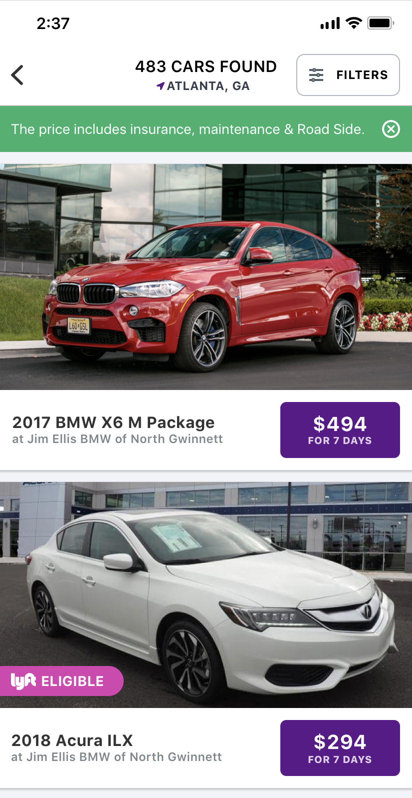

# Flexdrive Mobile Assessment

## Process

1. Fork this repo to private repo.
2. Check-in updates as you work.
3. Invite daniel.oneill@flexdrive.com to view private repo.
4. We'll contact you for follow up interview, next steps, etc.

## Project

Spend up to 2 hours creating a search results page similar to the included mockup. Use whichever libraries you are most familiar with.



GraphQL API URL: https://graph.qa.f1.flexdrive.com/

Sample query:

```
query Vehicles($skip: Int!, $take: Int!) {
    vehicles(query: { skip: $skip, take: $take }) {
      edges {
        node {
          id
          year
          make
          trim
          model
          rideshareEligible
          pricing {
            value
            duration
            durationUnit
          }
          location {
            id
            name
          }
          featureImage {
            url
          }
        }
      }
      totalCount
      pageInfo {
        hasNextPage
      }
    }
  }
```
